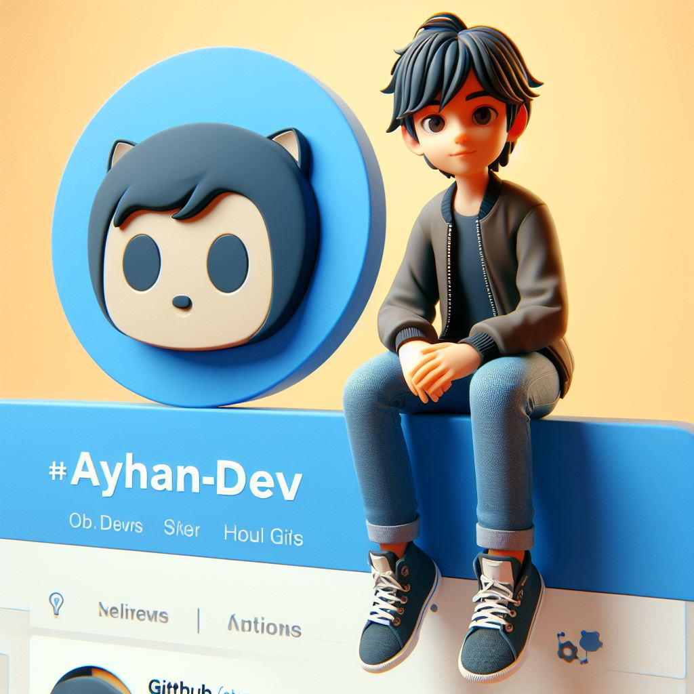

 

    
    
👋 Hi, I’m Ayhan-G.Y ♪ 

 # 💥 project main:
- [ForNRxt](https://github.com/ayhan-dev/fornrxt)
- [CVE LIST](https://github.com/ayhan-dev/CVE-LIST)
- [AND](https://github.com/ayhan-dev?tab=repositories)

 # 🗯️ info to me:
- Hi. I am Ayhan.(Caesar) 👋.
- Multi.stack developer ⭐️.
- specialist AI 🤖.
- Hacking and security activity.
- Experience +10 years.
- Email: ayhan.gy.dev@gmail.com

 
 # 🔗 Links to me 🔗

   

 
